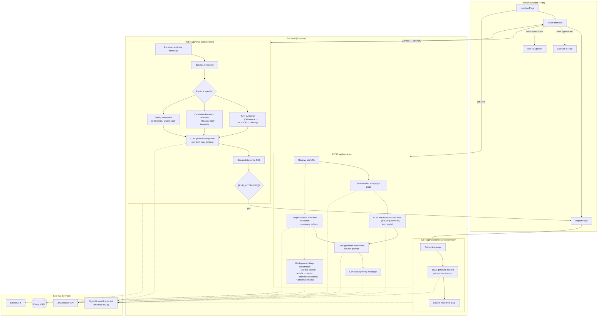

# interview.me

AI-powered voice interview practice platform. Paste a job posting URL, get a realistic mock interview tailored to the role, and receive a detailed performance report with scored feedback.

Built for the [DigitalOcean Gradient AI Hackathon](https://dograduation.devpost.com/).

## Architecture



### Key flows

**Session creation** — When a user submits a job URL, two things happen in parallel: Jina scrapes the posting and an LLM extracts structured data (requirements, tech stack, seniority), while Serper searches for real interview questions and company culture. This feeds into a meta-prompt that generates a role-specific interviewer persona. After the session is created, deep enrichment continues in the background — scraping search result pages (and Glassdoor/Blind snippets) for interview questions that get stored for the interviewer to reference.

**Voice loop** — The frontend runs a state machine: `AI_SPEAKING → LISTENING → PROCESSING → AI_SPEAKING`. Browser Web Speech APIs handle STT/TTS with no external speech services. The backend streams each interviewer response as SSE tokens.

**Interview runtime** — Every chat turn gets three injected system messages after the conversation history: turn guidance (controls question progression), candidate behavior detection (prevents the candidate from hijacking the interview or ending early), and a hard brevity constraint (keeps responses under 40 words). The model sees these in the recency position so they can't be diluted by the generated system prompt.

**Report generation** — Streamed on-demand when the user navigates to the report page. The LLM evaluates the full transcript and outputs a markdown report with scores parsed from a `SCORES_JSON:{...}` line.

## Project Structure

```
interview.me/
├── frontend/       React + Vite + Tailwind CSS (voice UI)
├── backend/        Express + PostgreSQL + DO Gradient AI
├── .do/            App Platform deployment spec
└── package.json    npm workspaces root
```

## Getting Started

### Quick Start (Docker)

The fastest way to run the full stack — no Node.js or PostgreSQL setup needed.

1. Install [Docker Desktop](https://www.docker.com/products/docker-desktop/)
2. Clone the repo and create a `.env` file in the project root:
```
DO_MODEL_ACCESS_KEY=your-key-from-digitalocean
SERPER_API_KEY=your-serper-key
JINA_API_KEY=
```
3. Run:
```bash
docker compose up --build
```
4. Open `http://localhost:8080`

### Manual Setup

#### Prerequisites
- Node.js 20+
- PostgreSQL (any recent version — 16, 17, or 18)
- [DigitalOcean Model Access Key](https://cloud.digitalocean.com/gen-ai/inference)

#### 1. Install PostgreSQL

**macOS (Homebrew):**
```bash
brew install postgresql
brew services start postgresql
```

**Ubuntu/Debian:**
```bash
sudo apt install postgresql
sudo systemctl start postgresql
```

#### 2. Create the database

```bash
createdb interviewme
```

#### 3. Install dependencies

```bash
npm install
```

#### 4. Configure environment

```bash
cp backend/.env.example backend/.env
```

Edit `backend/.env`:
```
DATABASE_URL=postgresql://your-username@localhost:5432/interviewme
DO_MODEL_ACCESS_KEY=your-key-from-digitalocean
PORT=3001

# Optional: Context enrichment APIs
SERPER_API_KEY=your-serper-key
JINA_API_KEY=your-jina-key
```

> To get a Model Access Key, go to [DigitalOcean GenAI Inference](https://cloud.digitalocean.com/gen-ai/inference) and create a key.

#### 5. Run

```bash
npm run dev
```

Frontend runs on `http://localhost:5173`, backend on `http://localhost:3001`. The Vite dev server proxies `/api` requests to the backend automatically. Database tables are created automatically on first startup.

## Scripts

| Command                  | Description                          |
| ------------------------ | ------------------------------------ |
| `npm run dev`            | Start frontend + backend concurrently |
| `npm run dev:frontend`   | Start frontend dev server only       |
| `npm run dev:backend`    | Start backend dev server only        |
| `npm run build:frontend` | Production build frontend            |
| `npm run build:backend`  | Production build backend             |

## Tech Stack

**Frontend:** React 19, Vite 8, TypeScript, Tailwind CSS v4, shadcn/ui, Motion, Web Speech API (STT/TTS)

**Backend:** Express 5, PostgreSQL, OpenAI SDK (DO Gradient compatible), Server-Sent Events

**AI:** DigitalOcean Gradient AI — `minimax-m2.5` for interview conversation, prompt generation, and report generation; `openai-gpt-oss-120b` for brief generation and search query planning

**Enrichment:** Jina Reader API (job page scraping), Serper API (interview question search)

**Deployment:** DigitalOcean App Platform (static site + service + managed database)

## API Endpoints

| Method | Path                                  | Description                              |
| ------ | ------------------------------------- | ---------------------------------------- |
| POST   | `/api/sessions`                       | Create interview session with enrichment |
| GET    | `/api/sessions/:id`                   | Get session + message history            |
| POST   | `/api/chat`                           | Send message, stream AI response (SSE)   |
| POST   | `/api/sessions/:id/end`               | End session                              |
| GET    | `/api/sessions/:id/report/stream`     | Stream performance report (SSE)          |
| GET    | `/api/sessions/:id/report`            | Get report (200 ready, 202 generating)   |
